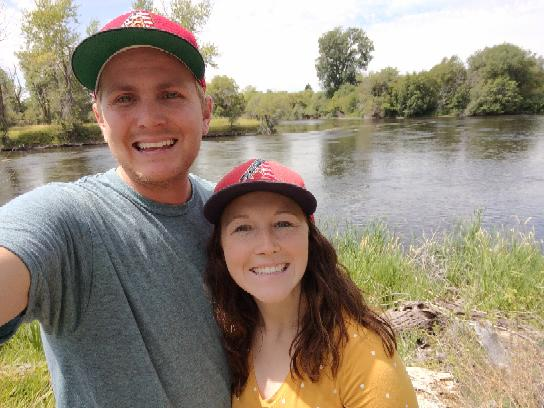

# Welcome to Data Strutures!

My name is Spencer Warner. I am a student pursuing a degree at Brigham Young University Idaho in Software Engineering. In CSE-212 I learned all about Data Structures from Brother Macbeth. This course will dive into three very useful data structures. The course is intended for someone familiar with Python and who is eager to learn about Data Structures.

This course will cover one module each week and is intended to take three weeks to complete. Each week dives into a single Data Structure located in individual modules. Each module will teach about the Data Structure, its performance, its limitations, and its applications. Follow the outline below to complete the course.

### For each module:
1. Read the "All About" tutorial.
2. Study the example problem.
3. Solve a the student problem on your own.
4. Compare your solution with the provided one.

## Course Overview:

* Week 1 - Queues
* Week 2 - Linked Lists
* Week 3 - Trees

### Module 1:
* [All About Queues](queue.md)
* [Example Problem](queue.py)
* [Student Problem](queue_student.py)
* [Student Problem Solution](queue_solution.py)

### Module 2:
* [All About Linked-Lists](linked_list.md)
* [Example Problem](linked_list.py)
* [Student Problem](linked_list_student.py)
* [Student Problem Solution](linked_list_solution.py)

### Module 3:
* [All About Trees](trees.md)
* [Example Problem](trees.py)
* [Student Problem](trees_student.py)
* [Student Problem Solution](trees_solution.py)

### Contact Info:
* spencerryanwarner1@gmail.com
* phone: 480-735-9477
* Class: CSE-212-2

### About Me:

I love the outdoors. I have been married to my wife for 3 years now. We are both from Arizona and we love the outdoors. I enjoy riding BMX bikes, ATV's and spending most my time outside.
 
 

