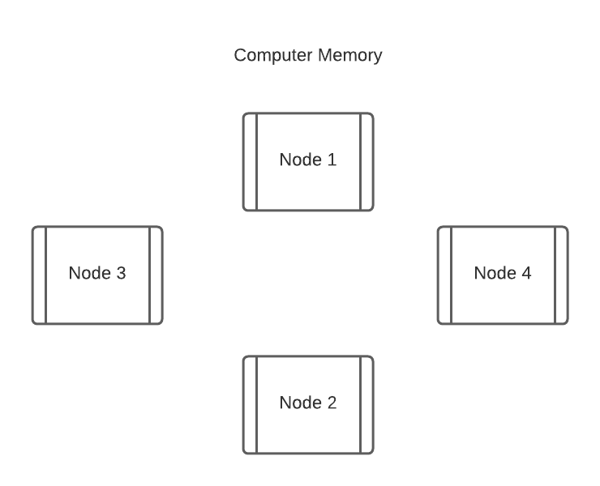
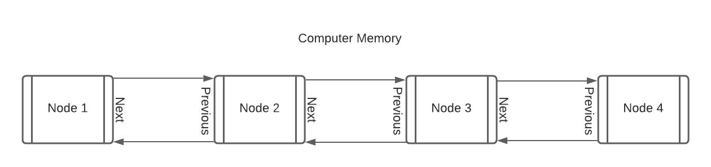
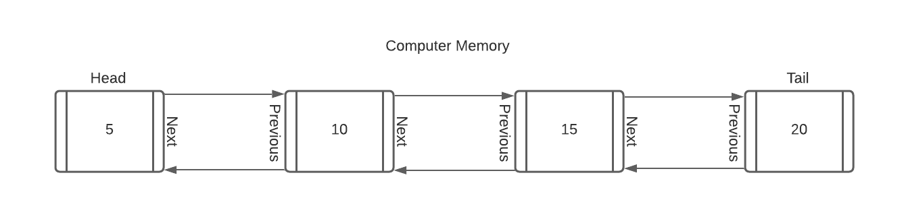
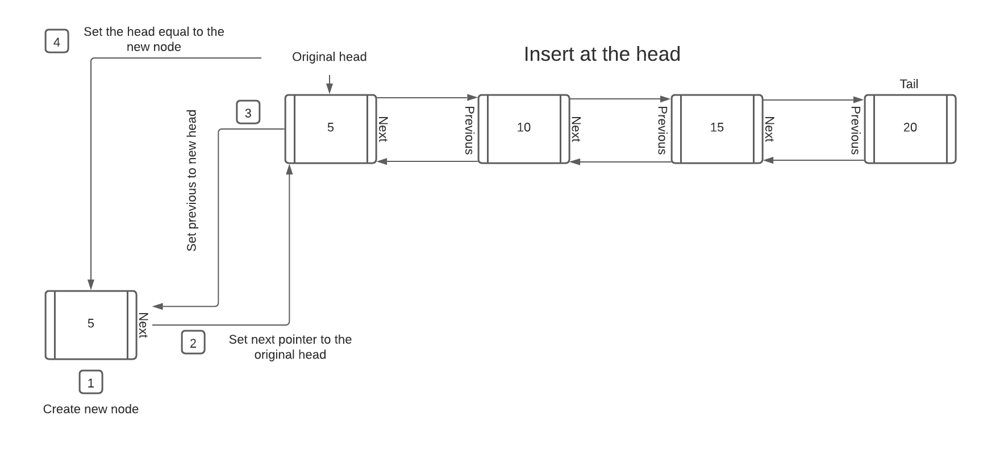
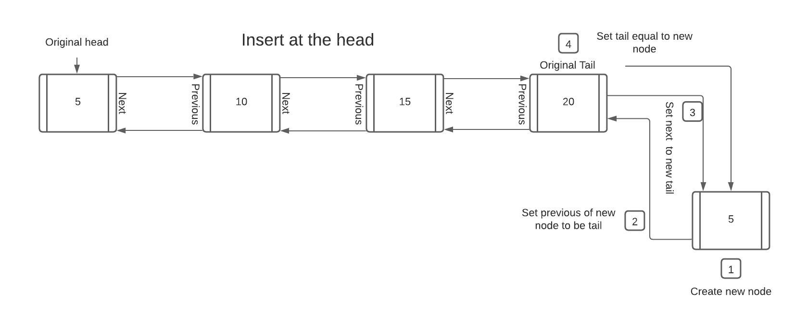
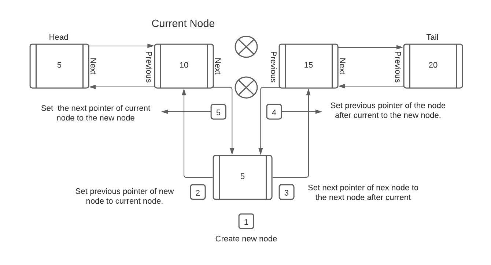
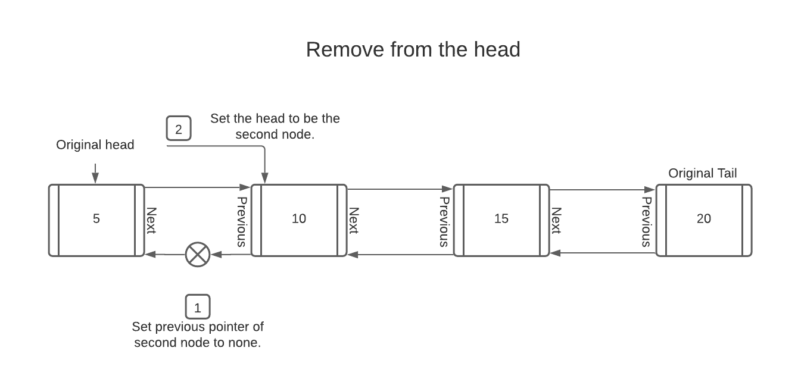
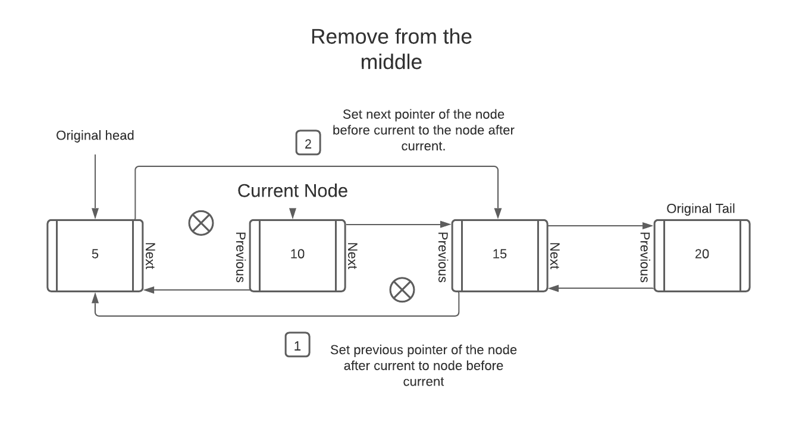

# All About the Linked List

* [Home](welcome.md)
<br/>
<br/>


When we think of an Array the elements are contiguous. Index 1 will always be after index 0 and before 2. Linked Lists are not contiguous and the elements of a linked list are called Nodes. Each node is stored somewhere in memory. Imagine the image below is a visualization of computer Memory. Notice how none of the nodes are in order. They are stored randomly throughout the computers memory.


<br/>
<br/>
<br/>

How do we keep track of all the Nodes? 

We use what are called pointers. Each node needs to have pointers that point to the next node as well as the previous one. Imagine pointers as arrows that connect each node in memory. Like the picture below, pointers allow us to keep track of what is next and previous.


<br/>
<br/>
<br/>

Is there a beginning and an end? 

Yes, linked lists need to have a beginning and an end. Without a beginning there would be no starting place. If we wanted to iterate through our linked list we would have no where to start. Likewise if we had no end we could not traverse backward through our linked list. The first node is the "head" or the beginning of the list. The last node is the "tail" or the end of the list. Lets label the picture a little more detailed and add some values to each node.



<br/>
<br/>
<br/>

How do we add and remove nodes?

This process can be a little hard to understand at first. Pay close attention to how the pointers or arrows are removed/added and in which order. If we remove the wrong pointer or arrow at the wrong time we can lose the node in memory.

The following are instructions with pictures to help understand how to insert and remove from a linked list:

We will used classes to impliment the linked list. 

# Insert at the head:

1. Create a new node called new_node.

2. Set the next pointer of the new node to the original head. This can be done by:
``` python
new_node.next = self.head
```

3. Set the previous pointer of the original head to the new node. This can be done by:
```python
self.head.prev = new_node
```

4. Set the head equal to the new node. This can be done by self.head = new_node
```python
self.head = new_node
``` 



<br/>
<br/>
<br/>

## Important note:
If the linked list is empty we need to set the head and tail to the new node that was created.
<br/>
<br/>
<br/>

# Insert at the tail:
The same four steps for inserting at the head can be followed. However, we need to do them in relationship to the tail. 

1. Create a new node called new_node.

2. Set the previous pointer of the new node to be the tail. 
```python
new_node.prev = self.tail
```
3. Set the next pointer of the original tail to the new node.
```python
self.tail.next = new_node
```
4. Set the tail equal to the new node. 
```python
self.tail = new_node
```



<br/>
<br/>
<br/>

# Insert in the middle:

Inserting at the middle is a little bit more complicated. Make sure to follow the order so nodes do not get lost in memory. Inserting at the middle requires 5 steps. 

1. Create a new node called new_node
2. Set previous pointer of new node to current node. This can be done by:
```python
new_node.prev = current
```
3. Set next pointer of new node to the next node after current. This can be done by: 
```python
new_node.next = current.next
```
4. Set previous pointer of the node after current to the new node. This can be done by:
```python
current.next.prev = new_node
```
5. Set the next pointer of current node to the new node. This can be done by:
```python
current.next = new_node
```



<br/>
<br/>
<br/>

# Remove from Head:
Follow the instructions below to remove the head.

1. Set previous pointer of the second node to none. This can be done by: 
```python
self.head.next.prev = None
```
2. Set the head to be the second node. This can be done by:
```python
self.head = self.head.next
```

## Important note:
If there is only one item in the list the head and tail would need to be none. This would essentially create an emply list. 


<br/>
<br/>
<br/>

# Remove from the Tail:
This is similar to removing from the head but at the tail. 

1. Set next pointer of second to last node to none. This can be done by:
```python
self.tail.prev.next = None
```
2. Set the tail to be the second to last node.
```python
self.tail = self.tail.prev
```


<br/>
<br/>
<br/>

# Remove from the Middle:
Removing from the middle is a little bit less complicated than inserting into the middle. There are only two steps rather than five. In the diagram the current node will the one that is being deleted.

1. Set previous pointer of the node after current to the node before current. This can be done by:
```python
current.next.prev = current.prev
```
2. Set the next pointer of the node before current to the node after current.
```python
current.prev.next = current.next
```


<br/>
<br/>
<br/>


# Performance:

Unlike an array we cannot simply append to the back or pop/delete. To add or remove a node we must redirect where the pointers are going. This is a little bit more involved but has significant advantages. We can simple move "pointers" or the arrows around and not have to shift every element in the list. This allows us to add and remove in O(1) time. 

There are some slight disadvantages to using a linked list. Although it can add and remove extremely efficiently if we need to find a node but do not know where it is in the list we have to start at the beginning or end and loop through every node until it is found. This results in O(n) time. An array has the advantage of really quick look up times. 

So in essence an array is really fast for searching because everything is indexed. However, an array is slow when it comes to adding/removing elements everywhere except the last element. 

A linked list is very efficeint when it comes to adding/removing. A linked list is slower when it comes to searching because we are required to visit each node. This results in the O(n) time.