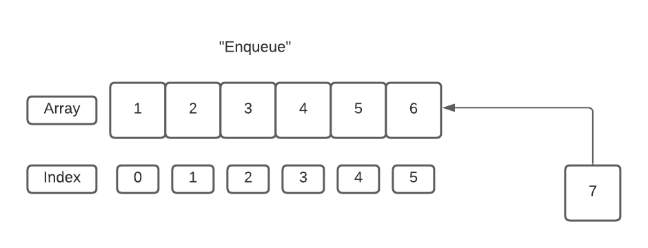
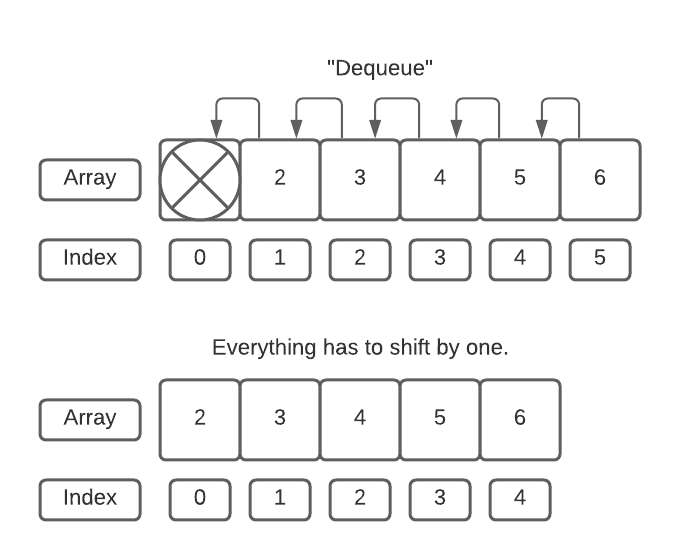

# All About the Queue!

* [Home](README.md)
<br/>

## Story:
To better explain how a queue works, picture the following scenario. You are just about to turn 16 and are so excited to finally have a drivers license. The day finally comes, and you ask you mom or dad to take you to the DMV to get your license. You walk into the DMV and there is a line going out the door. Conveniently placed is a ticket machine, you pull out a little piece of paper that has a number printed on it. The number is your place in line. You sit patiently for hours in those uncomfortable chairs until your number is called. Likely six hours later your number is called, you hand your ticket number to the person at the help desk. After a few minutes she hands you the long-awaited driver’s license. The person at the help desk then throws away your ticket number and moves on to the next person in line.
<br/>
<br/>


## Application:
A queue is very similar. Like the DMV if you were first in line you would be the first to finish. A queue is defined as being "first in", "first out" or FIFO for short. 

There are a few terms used in describing queues. 
1. "Front"
1. "Back"
1. "Enqueue"
1. "Dequeue"

Like the DMV example when you take a ticket to get your place in line that is similar to an "enqueue" in programming. In that moment of time, you are added to the very "back" of the line to eagerly await your turn to be called. As time goes on you progressively move up the wait line until it’s your turn to be at the "front".

When the person at the help desk throws away your ticket number, they are done helping you and it is time to move on to the next person. This would be compared to a "deque" in programming.

The simplest way to replicate this behavior in Python would be an array. However, an important note, this is NOT the most efficient way to perform a queue. The second module will go over Linked Lists and why that data structure would be a better method to implement a queue.

We can implement a queue using an array by simply appending to the back and deleting from the front. 

Here is an example of what an enqueue would look like. Notice when we "enqueue" the number is added to the "back".


```python 
queue = [1,2,3,4,5]
queue.append(6)
print(queue)

[1,2,3,4,5,6]
```

Here is an example of what a dequeue would look like. Notice when we "dequeue" the number is removed from the front.

```python
queue = [1,2,3,4,5,6]
queue.pop(0)
print(queue)

[2,3,4,5,6]
```

You can see how this process would be similar to a revolving door. Add to the back, remove from the front. Repeat this process over and over and over.
<br/>
<br/>

## Performance:

Another application of a queue would be a call center. Here is where it starts to get interesting and why the method used to implement the queue is so important. My sister works for Visa in the call center. She works at one of many locations and the volume of calls they receive is very large. When you are dealing with large numbers, performance matters a great deal. As programmers, we need to use the appropriate tools for the job. Just because you can dig a ditch with a hammer does not mean we should.
<br/>
<br/>

## Enqueue:
When you "enqueue" or append to the "back" of an array the performance is O(1). no big deal, this is constant time and the computer will not even bat an eye. 


<br/>
<br/>

## Dequeue:
When you "deque" or delete from the "front" of an array the performance is O(n). If you have a large number of elements in an array, the performance takes a serious hit. The array will need to shift every element to the left one position. If you have thousands of people in the queue and are constantly shifting every element by one this is taxing on the computer.

