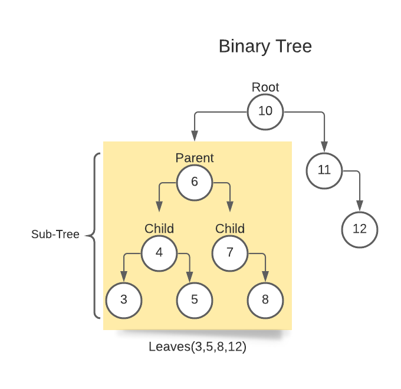
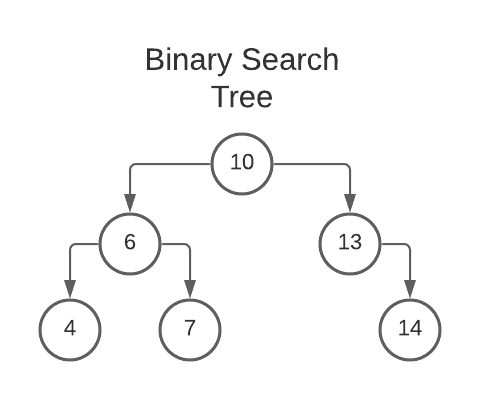
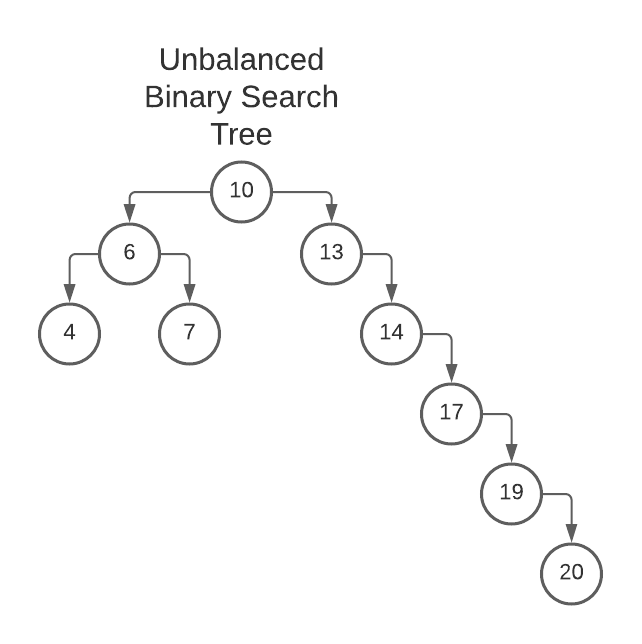
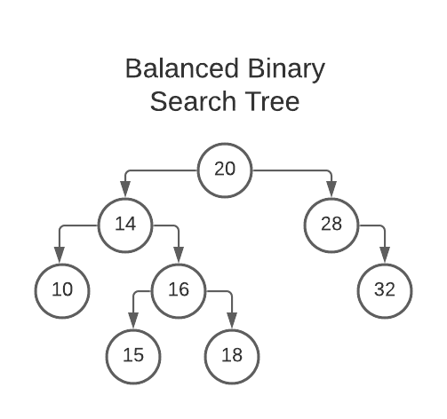

# All About Trees

* [home](README.md)

We learned linked lists are connected with pointers. Each node has pointers that identify the next and previous nodes. These pointers only go to one other node. Trees are similar to linked lists in that they each have pointers to identify where things are located. However, trees can have pointers to multiple different nodes. We will talk about three different types of trees. First, binary trees. Second, binary search trees. Third, balanced binary search trees.

## Common terminology using trees
* Node (Trees are organized using nodes and pointers.)
* Root (The very top node, i.e. the first node.)
* Parent (A node that has connected nodes)
* Child (Nodes that are connected to the parent)
* Leaf (Nodes that connect to no other node)
* Sub-Tree (Nodes left and right of any parent tree create a sub-tree)
* AVL tree (Adelson-Velskii and Landis - In a balanced tree the difference in height between two subtrees less than two.)
* Balanced (The difference in height betwen two sub-trees is minimally different)
* Binary Search Tree (BST)
* Recursion (Calling a function from within a function)

## Binary trees:
A binary tree links to no more than two nodes. The picture below represents a binary tree. Each circle is a node. Notice how not a single node points to more than two other nodes. The first node at the top is called the root. As we move down the tree we can see that number 6 is a parent that contains two children 4 and 7 because it is a node that has other connected nodes. When we get to the bottom of the tree the last nodes are called the leaves. We use pointers to keep track of where things are in the tree. This keeps things nice and orderly. Trees have serious performance abilities which we will talk about a little later. 
 
 

## Binary search trees:
A binary search tree follows specific patterns for inserting data into the tree. If we keep things in order from the beginning it is really easy to search for information far down in the tree.  Notice how the tree is sorted by less than or greater than values. Again, we start at the root and perform less than or greater than comparisons. The nodes to the left are less than the previous, while the nodes to the right are greater than the previous. This process is implimented down the entire tree. Other similar boolean methods can be implimented with trees but for simplicity we will use numbers and greater than or less than operators. We can see that 6 is less than 10 so the 6 goes on the left side of the tree. However, 7 is greater than 6 so they go to the right. The point of creating a tree like this is to keep information organized and easy to access. Since things are greater than or less than we can do a simple comparison and essentially rule out half of the data in one comparison. Each time we move down the tree we can eliminate half of the information until the correct node is found. This results in a performance of O(log n) which is great! However, this only works if the information is organized in the correct way and the tree is balanced. We will talk more about balanced binary search trees in the next example.

 
 

Lets walk down this tree in the picture below. We will talk more about how we move down the tree at the end of the lesson.
* The root is 10
* 6 < 10 so it goes to the left.
* 7 > 6 so it goes to the right of 6.
* 4 < 6 so it goes to the left of 6.
* 13 > 10 so it goes to the right of 10.
* 14 > 13 so it goes to the right of 13.
 
 

## Balanced binary search tree:
The tree in the bicture is considered to be unbalanced because it extents more than two nodes past any other sub tree. The height of a tree can be found by counting the maximun number of nodes from the root to the leaves. The left side of the tree extents to a maximum height of 3. The right side of the tree extends to a maximum height of 6. We can clearly see that the max height is greater than two resulting in an unbalanced tree. This can result in O(n) performance because to find the last node on the right we will have to make a comparison at every value. There are more simplified data structures to handle O(n) performance...we can do better. Lets walk down the tree and search for the node containing 20.
* 20 > 10 
* 20 > 13
* 20 > 14
* 20 > 17
* 20 > 19
* We can clearly see that we moved down the tree O(n) times because we are not removing half of the data at each comparison. 

 

Lest examine a balanced binary search tree:

This is an example of a balanced tree because the maximum height difference between any two subtrees is less than two.
Lets walk down this tree to find 18:
* 18 < 20 we eliminate half of the tree.
* 18 > 14 we eliminate half of the tree again.
* 18 > 16 we found 18!

 

 
 

# How to self balance a tree?
You have probably noticed by now that this data structure can be really fast. I am certain you have noticed that the most effecient scenario for searching trees is when the root is closet to the middle of all the data. So lets say we have a balanced tree and then we insert a ton of new data and now it is no longer balanced. We can balance this tree by moving each node around until the middle is the root. This allows us to always keep our information organized and super fast to access. 

# RECURSION!!!
So we have done a fair bit of walking through trees and I am sure at this point and you are becoming somewhat of a tree lover. So how do we walk down each node in a tree? This is done through a process called recursion. Recursion can be confusing so pay close attention to your "base cases". 

## So what is Recursion?

Recursion is defined as calling a function from within a function. Lets think about that for a second. If I call a function inside of a function will it call itself forever??? or until my computer decides to give up the ghost???? Yes it will. This is a problem.

## So how do we avoid this problem?

Think of a while loop and how we succesfully exit the loop. Once our specified condition is met we exit the loop. This is similar to what a base case is in recursion. If we call our function over and over again until we achieve what we want. Essentially we visit all of the parts of the tree necessary to find what we are looking for. Once we find what we want we can exit by not calling the function anymore. This ends the process of recursion and does not crash our computer. Making base cases can be tricky just like while loops can be tricky so we need to make sure that our base cases are robust, simple, and well thought out. This means that our if and else statements need to be clear and account for all the different scenarios we will encounter. 

